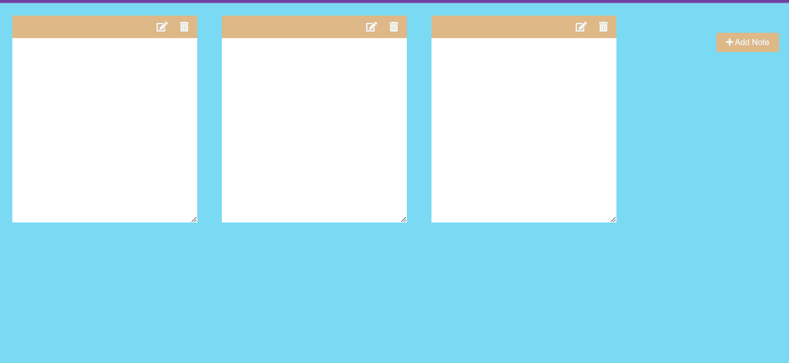

# Note Taking App



## Description

The Note Taking App is a simple web application built using HTML, CSS, and JavaScript that allows users to create and manage notes. Users can add new notes, edit existing ones, and delete notes as needed. The app also supports markdown rendering for rich text notes.

## Features

- Add new notes with a click of a button.
- Edit notes to add content or make changes.
- Delete notes when they are no longer needed.
- Supports markdown rendering for formatted text.
- Clean and intuitive user interface.

## Technologies Used

- HTML
- CSS
- JavaScript
- [Marked](https://marked.js.org/) library for markdown rendering
- [Font Awesome](https://fontawesome.com/) for icons

## Installation

1. Clone the repository:

   ```bash
   git clone https://github.com/yourusername/your-repo-name.git
